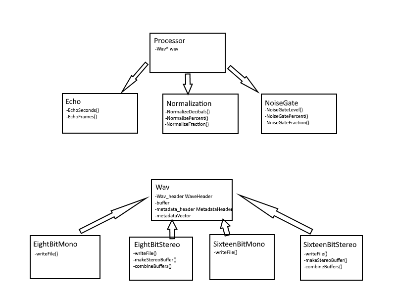

# CS 202 Semester Project

## GROUP MEMBERS:

Eric Ashton Westenburg - File I/O, User Interaction

Carver Goldstein - Wav Processors, User Interaction

Bryce Millis

## DESIGN DESCRIPTION:

As the project outlined we divided the program in to a few modules, the File I/O contained in the Wav class, the wav processors in the Processor class, and the user interaction in the main function. The program reads in the audiofiles from the directory given on the command line and stores them in a vector. Each of these files are read and their technical information, audio data, and metadata are saved in a Wav object. The Wav object is created as a subclass based on the number of channels and bit depth of the audio file. The user is prompted to apply any of the processors to the audio data, and the data buffer is edited accordingly and saved. Then, the user is prompted to edit any metadata for each file, they can either override current metadata or save new metadata. Finally, they are asked if they would like to create a CSV file containing the information on each file. If they say yes, a CSV file is created. 

## CHALLENGES FACED:

-Never having dealt with a program this large before

-Combining modulated code done by different people

-Putting ourselves under time constraints

-METADATA!!
